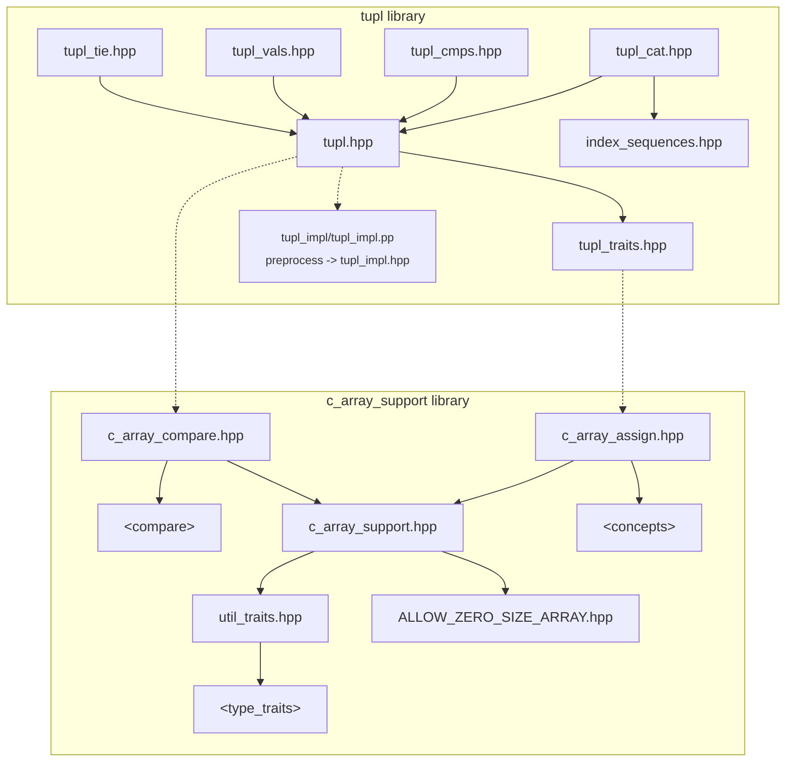
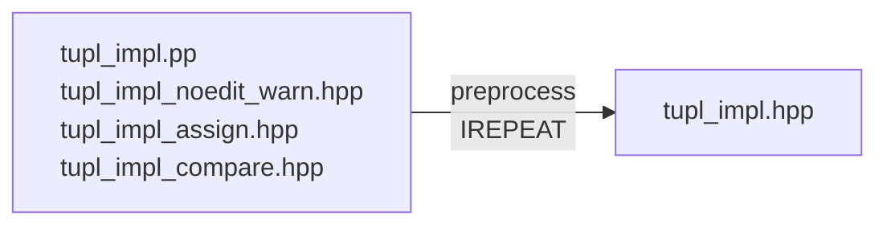

# `tupl`: aggregate tuple types

## Minimal C++20 tuples, traits and tools

<details><summary>Copyright &copy; 2023 The Lemuriad.
Distributed under BSL V1.0</summary>

### **Boost Software License** - Version 1.0 - August 17th, 2003

```txt
Permission is hereby granted, free of charge, to any person or organization
obtaining a copy of the software and accompanying documentation covered by
this license (the "Software") to use, reproduce, display, distribute,
execute, and transmit the Software, and to prepare derivative works of the
Software, and to permit third-parties to whom the Software is furnished to
do so, all subject to the following:

The copyright notices in the Software and this entire statement, including
the above license grant, this restriction and the following disclaimer,
must be included in all copies of the Software, in whole or in part, and
all derivative works of the Software, unless such copies or derivative
works are solely in the form of machine-executable object code generated by
a source language processor.

THE SOFTWARE IS PROVIDED "AS IS", WITHOUT WARRANTY OF ANY KIND, EXPRESS OR
IMPLIED, INCLUDING BUT NOT LIMITED TO THE WARRANTIES OF MERCHANTABILITY,
FITNESS FOR A PARTICULAR PURPOSE, TITLE AND NON-INFRINGEMENT. IN NO EVENT
SHALL THE COPYRIGHT HOLDERS OR ANYONE DISTRIBUTING THE SOFTWARE BE LIABLE
FOR ANY DAMAGES OR OTHER LIABILITY, WHETHER IN CONTRACT, TORT OR OTHERWISE,
ARISING FROM, OUT OF OR IN CONNECTION WITH THE SOFTWARE OR THE USE OR OTHER
DEALINGS IN THE SOFTWARE.
```

[](https://www.boost.org/LICENSE_1_0.txt)

Also at [boost.org](http://www.boost.org/LICENSE_1_0.txt) and accompanying file [LICENSE](LICENSE)

</details>

<table style="width: 100%; border: none;" cellspacing="0" cellpadding="0" border="0">
  <tr>
    <td><a href="https://github.com/Lemurian-Labs/tupl/actions/workflows/ci.yml"></a></td>
    <td>GHA meson build: linux gcc 12, clang 14, MSVC latest</td>
  </tr>
</table>

<table style="width: 100%; border: none;" cellspacing="0" cellpadding="0" border="0">
  <tr>
    <td><a href=https://godbolt.org/z/85Tex45c1></a></td>
    <td>Please experiment with <code>tupl</code> and report any issues<br>
        $\Leftarrow$ follow this link to 'godbolt' online C++ compilers</td>
  </tr>
</table>

----

## Contents

<details><summary>Click to expand</summary>

* [`tupl` introduction](#tupl-introduction)
* [`tupl` API by example](#tupl-api-by-example)
* [`ties` introduction](#ties-introduction)
* [`ties` API examples](#ties-api-examples)
* [`tuplish` types synopsis](#synopsis-of-tuplish-types)
* [Comparisons](#comparisons)
* [Aggregate properties](#aggregate-properties)
* [Layout](#layout)
* [Member ids](#member-ids)
* [Headers](#headers)
* [Dependencies](#dependencies)
* [Build](#build)
* [Appendices](#appendices)

</details>

----

## `tupl` introduction

`tupl` is a C++20 library named after its core type:

* `tupl`: a
[Rule of Zero](https://isocpp.github.io/CppCoreGuidelines/CppCoreGuidelines#Rc-zero)
tuple type that wants to be a builtin.

It depends only on `std` library `<concepts>` and `<compare>`.

It follows familiar tuple APIs, as far as possible for an aggregate  
type, and also introduces some API innovations.

----

### **`tupl`** types

Imagine if C++ had tuples built in to the language...

* `struct<Xs...>` $\rightarrow$ `struct { Xs...xs; };`

That is, a tuple is a simple struct
[aggregate](https://en.cppreference.com/w/cpp/language/aggregate_initialization)
with types `Xs...`  
expanded directly as data members in the struct body.

For example, a pair would be:

* `struct<X0,X1>` $\rightarrow$ `struct {X0 x0; X1 x1;};`

The `tupl` and `lupl` library types approach this builtin ideal.

#### **`tupl`**`<Xs...>`

 $\rightarrow$ `struct {[[no_unique_address]] Xs...xs;};`

With
[`[[no_unique_address]]`](https://en.cppreference.com/w/cpp/language/attributes/no_unique_address)
attribute on all its members  
the compiler is allowed to optimize `tupl` member layout.  

Now, `tupl` layout has no portability guarantees so we also  
need a stable,
[standard-layout](https://en.cppreference.com/w/cpp/named_req/StandardLayoutType)
type; a 'layout tupl':

* `lupl<Xs...>` $\rightarrow$ `struct { Xs...xs; };`

Use `lupl` for guaranteed, portable standard layout.  
Use `tupl` if layout optimization is more important.

From now on we take `tupl` to mean 'tupl or lupl'.

#### **Triviality**

* If `Xs...` are all
[trivial](https://en.cppreference.com/w/cpp/named_req/TrivialType) /
[structural](https://eel.is/c++draft/temp.param#def:type,structural) /
[regular](https://en.cppreference.com/w/cpp/concepts/regular) types  
then `tupl<Xs...>` is a trivial / structural / regular type.

Aggregate structs acquire shared properties of their members.  
In particular, a `tupl` is
[*TriviallyCopyable*](https://en.cppreference.com/w/cpp/named_req/TriviallyCopyable)
if all its elements are.

Trivial types are cheap to pass to and return from functions, and  
triviality enables deeper inlining and optimization of call stacks.

`tupl` has *no non-static member functions*.
A
[Rule of Zero](https://en.cppreference.com/w/cpp/language/rule_of_three#rule-of-zero)
type,  
it relies on builtin language mechanics for much of its 'API'.

`tupl` is used primarily as a value type (its CTAD deduces values).

`tupl` also serves as a base class for deriving other `tuplish` types  
that may hold references, add constructors or member functions.

----

### `tuplish` types

<details><summary>
<code>tupl</code> has two traits that identify it as a
<code>tuplish</code> type.
</summary>

* A member typedef `tupl_t = tupl`
* A function `map(t,f) -> f(t.xs...)`

`map` is a hidden friend function of `tupl`.  
`map(t,f)` calls `f` with the members `xs...` of `tupl_t t`.  
</details>

Types derived from `tupl` inherit these `tuplish` traits.

The library defines three derived `tuplish` types:

* `ties` is a reference-tupl with assign-through semantics.  
It supports non-same-type 'heterogeneous' assignments.

* `vals` is a value tupl with extended assignment operators.

* `cmps` is a tupl with heterogeneous comparison operators.

`ties`, `vals` and `cmps`, like `tupl`, are all aggregate types.

----

### `tupl` copy and compare are same-type only

<details><summary>
<code>std::tuple</code> operations are heterogeneous.
</summary>

* It constructs from any list of convertible-from types.
* It assigns from any tuple of assignable-from types.
* It compares with any tuple of comparable-with types.

In retrospect, these defaults might not be chosen today.
</details>

`tupl`'s builtin operators and default comparisons naturally work  
only between operands of the same type.

This same-type restriction is a safe default for a core tuple type.  

For mixed type, heterogeneous operations use the appropriate  
specialized tuplish type or one of the free functions provided.

----

## `tupl` API by example

`tupl` mostly just works as you'd expect a C++ tuple type to work.  
The examples below highlight cases where `tupl` differs from `tuple`.  

The differences derive from `tupl`'s aggregate nature. Understanding  
aggregates is key to comprehending and making best use of `tupl`.

### Aggregate nature

As an aggregate type `tupl` has no constructors so initialization means  
aggregate initialization; it's builtin.

<details><summary>
<code>tupl</code> embraces curly braces as the natural way
to initialize aggregates.</summary>

${\quad}$ Since C++20, aggregates can also be initialized with parentheses  
${\quad}$ (so constructor syntax can construct objects of any unknown type)  
${\quad}$ but the parens admit narrowing conversions and argument decay.

${\quad}$ Prefer curlies for aggregates, and for aggregate-like classes.  
${\quad}$ Use parens only in generic code that initializes unknown types.
</details>

`tupl` supports class template argument deduction
{[CTAD](https://en.cppreference.com/w/cpp/language/class_template_argument_deduction)},
with braces:

```c++
  tupl<char[4],int> cc{"C++",14}; // Explicit type

  tupl cppstd{"c++",17}; // CTAD -> tupl<char[4],int>
```

Note how the string literal `"c++"` is deduced as `char[4]`, and initialized.  
Different size string literals result in different types.

C arrays are also aggregates but they're not regular, copyable types.  
The `tupl` library treats them as if they're regular, but reality bytes;  
C arrays remain an awkward edge case, so feature in most examples.

String literals are overused in the snippets as convenient C array literals  
that also conveniently succeed in initializing their `char[]` array target.

`std::tuple` would deduce `char const*` and force decay-to-pointer.  
With `tupl`, the programmer must take the address explicitly, if wanted:

```c++
  tupl cpp{&"cpp"}; // CTAD -> tupl<const char*>
```

`tupl` assignment is also builtin as it defines no `operator=` overloads.  
We call assignment from braced initializer lists 'aggregate assignment'  
because it works by aggregate initialization  followed by copy-assignment.

A right hand side temporary of left hand side type is aggregate initialized  
then copy-assigned to the left hand side (hopefully with copies elided):

```c++
  cppstd = {"c++",17}; // 'Aggregate assignment'
  cppstd = {{'c','+','+','\0'},17}; // Equivalent
  cppstd = {}; // Aggregate assign clear all fields

  cppstd = {"cpp"}; // Warning: missing initializer
  cppstd = {"cplusplus",20}; // FAILs to compile
//  char[10] ^^^^^^^^^ too large for char[4] field
```

Braces catch narrowing conversions in initialization and assignment.  
There's a warning when unsigned `next` is assigned to the `int` field:

```c++
  const char lang[] = "cpp"; // array variable
  unsigned int next = {26U}; // unsigned vs signed
  
  cppstd = {"cpp",next}; // Warning/error: narrowing
  cppstd = {lang,26}; // FAILs to compile:
   // array ^^^^ initializer can't initialize array
```

Here, the array variable `lang` can't initialize the array field  
(string literals are the only array values that are valid initializers)  
(workarounds to deal with arrays are presented below).

Comparisons also work by builtin aggregate rules, with library opt-in:

```c++
  if (cppstd != tupl<char[4],int>{})
    return cppstd < tupl{"c++",20};
```

Unfortunately, the grammar doesn't allow a braced initializer list as the  
right hand side of a comparison operator, so an explicit `tupl` type has to  
be constructed in order to use the comparison operators.

_The following material is specific to C arrays and can be skipped_.

#### **C arrays**

`tupl` goes out of its way to support C arrays as-if regular values.  
C arrays are aggregates and *aggregates should stick together*.

<details><summary>
Details and rationale of C array support.
</summary>

C arrays are irregular objects; they're not copyable or comparable.

C arrays, when members of structs, are regularized by language rules  
that make structs copyable; copy-constructors and copy-assignment  
operators are implicitly synthesized to deal with array members.

Comparisons can also be synthesized automatically, since C++20.  
If `operator<=>` or `operator==` are  user-defined as `=default`  
then lexicographic comparisons are generated for array members.

`tupl` naturally regularizes C arrays using this language support.

`tupl` also goes further:

* `tupl` assumes that C arrays are regular copyable objects.

It treats arrays as regular and doesn't accommodate their irregularity.  
Attempts to copy arrays work if possible, or cause compiler errors,  
and never result in silent decay-to-pointer and pointer copy.

`tupl` is designed to be ready for a future in which C arrays _are_ regular  
with workarounds to deal with the reality that they aren't regular yet.

The CTAD guide is a consequence of this design choice:

* `tupl` deduces arrays as arrays, with no decays.

Now, array members deduced from array-valued initializers cannot be  
initialized by those initializers (!) because language rules don't provide  
copy construction of array members from array variable initializers.
</details>

<details><summary>
<code>tupl</code> custom CTAD guide, deduces values with no decay.
</summary>

```c++
template <typename...Xs> tupl(Xs const&...)
                      -> tupl<Xs...>;
```

`tupl`, as a struct aggregate, has an implicit default deduction guide  
that acts to decay array-valued initializers (apart from string literals)  
to pointers.
This deduction guide overrides it to prevent the decay.
</details>

`tupl` deduces arrays from array initializers, but initialization fails.  
The workaround is to use a function to do the initialization:

* `tupl_init` 'maker function' is a workaround for arrays.

```c++
  char a[]{"A"};
  tupl c{a}; // FAILS: can't initialize tupl<char[2]>

  #include <tupl/tupl_cat.hpp>
  auto c = tupl_init(a); // Maker function workaround
```

----

### `tupl` API

Let's take a slightly higher level look at `tupl`'s API.

```c++
#include <tupl/tupl.hpp>

constexpr lml::tupl t012 = {0,1U,"2"};

auto tupl_API(lml::tupl<int,unsigned,char[2]> t = t012)
{
/*
    ... Example code expanded below ...
*/
  return lml::tupl{t, true}; // Nested tupl return
}

auto [ret,err] = tupl_API(); // Structured binding
```

`tupl_API` takes argument `t` of type `tupl<int,unsigned,char[2]>`  
the same type deduced for global constant `t012` from `{0,1U,"2"}`.

The return type is `tupl<tupl<int,unsigned,char[2]>, bool>`

> **Note**: Compilers disagree on the layout and `sizeof` the return type.  
> For portable standard layout use 'layout tuple' `lupl` instead of `tupl`.  
> Otherwise, `tupl` may be more efficient.
See [layout](#layout).

This `tupl` type is a regular type, both copyable and comparable, because  
all its fields are regular, or arrays of regular, types.

Unlike `std::tuple`, only same `tupl` types are copyable and comparable:

```c++
  tupl<int,int,char[2]> d{t}; // FAIL: type mismatch

  auto s{t}; // Copy construct, as struct aggregate
  assert(s == t); // Builtin compare for same types
  s = t; // Copy-assign, aggregate struct builtin
  s = {0,1,"2"}; // OK, 'aggregate assignment'

  s = tupl{0,1,"2"}; // FAILs to compile: mismatch
  assert(s == tupl{0,1,"2"}); // FAIL: type mismatch

  assert(equals(s,{0,1,"2"})); // OK, converts types
```

Free functions `equals` and `compare3way` can compare with braced list  
arguments, including the empty list (but incomplete lists are rejected):

```c++
  equals(t,{});
  compare3way(t,{1,2,"3"});
```

`tupl` has a specialized `swap` free function (not a friend and not a CPO)  
(it is otherwise specified similarly to C++20
[`std::ranges::swap`](https://en.cppreference.com/w/cpp/utility/ranges/swap)).

You should use the
[ADL 'two step'](https://quuxplusone.github.io/blog/2020/07/11/the-std-swap-two-step/)
if `std` types may be involved:

```c++
  using std::swap;
  swap(s,t); // Specialized elementwise lml::swap
```

Structured bindings to `tupl` use the builtin aggregate rule (and not the  
`std` 'tuple protocol' which involves specializing `std` template traits):

```c++
auto [ret,err] = tupl_API();
```

A plain `auto` binding makes a copy of the right hand side  
(a copy is generally wanted when binding to a function return type).

For mutable access, though, remember to use a reference binding;  
`&&` is always good:

```c++
  auto&& [i,u,c2] = s;
```

Structured binding looks a bit like the  inverse of aggregate initialization.  
These bindings let us illustrate pros and cons of aggregate initialization:

```c++
  t = {i,u}; // WARN of missing initializer, and...
  t = {u,i}; // WARN or FAIL, narrowing conversions

  t = {i,u,c2}; // FAIL: array variable initializer
  tupl c{i,u,c2}; // FAIL: array variable initializer
```

Compilers will warn about missing initializers or implicit conversions.  
Make sure that the warnings are enabled, and act on them, then struct  
aggregates are as safe as or safer than tuples that have constructors.

We've seen that aggregate initialization doesn't accept
C array variables  
as initializers so this also hits aggregate assignment.

The workaround for dealing with array variables is to use free functions  
`assign` or `assign_elements` (they're also defined for C arrays):

```c++
  assign(t) = {};
  assign(t) = {i,u,c2};

  assign_elements(t,i,u,c2);
```

`assign_elements` allows elementwise move or copy and avoids the  
possible creation of temporaries in braced initializer constructs.

----

### `tupl` access

Now, let's look at `tupl` access alternatives:

* `get<I>(t)` provides the usual indexed access.  
* `getie<I...>(t)` is a combined `get` and `tie`  
(from `tupl/tupl_tie.hpp`)

`tupl` elements are all public and can be accessed directly by member id,  
by structured binding (as we've seen) or by pointer-to-member:

```c++
  t.x0 = {1}; // Direct access by known member id
  get<1>(t) = {2}; // Usual indexed get<I> access

  constexpr auto first = lml::mptr<0,decltype(t)>;
              // = &tupl<int,unsigned,char[4]>::x0
  t.*first = {0}; // Access via a member-pointer

  get<2>(t) = {"3"}; // FAIL: can't assign arrays
```

Note the use of braces on the right hand sides, to catch conversions.  
The workaround for array member access is to use `assign` or `getie`:

```c++
  lml::assign(get<2>(t)) = {"3"}; // array assign
  getie<2>(t) = {"3"}; // From <tupl/tupl_tie.hpp>
```

----

### `tupl` `map`

`map` is a helper function for iterating `tupl` elements as a variadic pack.  
It's a generic access facility for implementing other accessors.

`map` is a
[hidden friend function](https://www.justsoftwaresolutions.co.uk/cplusplus/hidden-friends.html)
defined within `tupl` classes.

As such, `map` is  hidden from ordinary name lookup and can only be found  
by [ADL](https://en.cppreference.com/w/cpp/language/adl),
argument dependent lookup, when passed a `tupl` argument.

`map(t,f)` calls functor `f` with tupl `t`'s elements `xs...` as arguments:

`map(t,f) -> f(xs...)`

The functor `f` will usually accept `xs...` as a variadic argument pack.  
This `map` example adds 3 to each element of a tupl `t`:

```c++
  lml::tupl t = {1,2U,3L};

  map(t, [](auto&...xs){
                  ((xs += 3), ...);
         }
  );
  assert((t == lml::tupl{4,5U,6L}));
```

The fold expression `((xs += 3), ...)` unrolls to evaluate as  
`((t.x0+=3), (t.x1+=3), (t.x2+=3))` - the `xs...` argument pack  
is unfolded by `...`, which then expands the comma operator expression.

As a fuller example of `map` usage, here's a `tupl` stream printer:

```c++
#include <iostream>
using std::ostream;

#include "tupl.hpp"
using lml::tuplish; // Concept to accept tupl-likes
using lml::as_tupl_t; // Cast to embedded tupl type

ostream& operator<<(ostream& out, tuplish auto const& t)
{
  return map(as_tupl_t(t), [&out](auto&...xs) -> auto&
  {
    char sep = '{';
    auto sep_out = [&]{ // Output '{' on first call
           out << sep; // Output ',' on following calls
           [[maybe_unused]]static auto _(sep = ',');
         };

    return (out << ... << (sep_out(), xs)) << '}';
  });
}
```

The `tuplish` concept requires a member typedef `tupl_t` on which a  
`map` function is defined. Prior to calling `map`, the `as_tupl_t(t)` cast  
assures that the embedded type is used for lookup.

The simpler fold expression `(out << ... << xs)` unrolls as  
`(out << t.x0 << t.x1 << t.x2)` to output each element in turn  
(the `sep_out` function uses a 'cute' trick to update the separator `char`  
`sep` from open-brace '`{`' to comma '`,`' as a side effect of its first call).

Here it is in use:

```c++
extern auto tupl_API(); // From the earlier snippet

int main()
{
    std::cout << std::boolalpha << tupl_API();
}
```

This prints the nested tupl return value as `{{4,5,6},true}`

----

## `ties` introduction

`ties` type derives from `tupl` and adds a set of `operator=` overloads:

* **`ties<Xs...>` : `tupl<Xs...>`** $+$ `operator=`

The use case is reference-tuples.  
Tuples of references are used for:

* Grouped, simultaneous assignment to multiple variables.
* Forwarding of argument lists to functions.
* Lexicographic comparison of lists of variables  
(better handled by `cmps`).

`ties` are trivially copyable so they can be cheap to pass around.

A `tie` 'maker function' is the preferred way to make `ties`:

* `tie(xs...)` $\rightarrow$ `ties<decltype(xs)&...> const`

`tie` accepts only lvalues and deduces lvalues as assignment targets  
and returns a const-qualified `ties`.

`tie_fwd` forwards its `auto&&` arguments as lvalues or rvalues:

* `tie_fwd(xs...)` $\rightarrow$ `ties<decltype(xs)...> const`

(similar to
[`std::forward_as_tuple`](https://en.cppreference.com/w/cpp/utility/tuple/forward_as_tuple)).

### Why `const` ?

The const qualifier removes the deleted default assignment operators from  
consideration. The resulting const-qualified type satisfies *const-assignable*  
concept, identifying it as an 'assign-through' reference type.

----

## `ties` API examples

```c++
#include "tupl_tie.hpp"

bool tie_API(int i, unsigned u, char(&c2)[2])
{
  if (equals(lml::tie(i,u,c2), {})) // all elem==T{}
    lml::tie(i,u,c2) = {1,2,"3"}; // assign-through

  lml::tie(i,u,c2) = {}; // clear all to = {} init
  char four[] = "4";
  lml::tie(c2) = {four}; // assign from array lvalue
  lml::tie(c2) = {{'5'}}; // assign from array rvalue

  lml::tupl t = {1,2,"3"};

  get<2>(t) = {"5"}; // FAILs to compile
  getie<2>(t) = {"5"}; // assign to array element
  getie<0,1>(t) = {3,4}; // multi-index get -> tie

  return z;
}
```

`ties` list-assignment is no longer builtin aggregate assignment.  
`t = {...}` is implemented with similar semantics to the builtin;  
the syntax extends nicely to reference ties just as for value tuples.

`ties` list-assignment improves on builtin aggregate assignment in  
that it avoids creating temporaries in some cases, and it handles arrays.  
However, it only handles all-move or all-copy assignments, not a mix.

`ties` also admits assignments from other tuplish types:

```c++
  lml::tie(cp,mv) = tie_fwd(cc, std::move(mm));
```

Here, copy and move assignments are mixed by assigning from a  
forwarding tuple that ties both lvalue and rvalue references.

----

## Synopsis of `tuplish` types

* `tupl{v...}` the basic tuple; Rule of Zero, deduces all values,  
$\quad\quad\quad\quad\quad$ adds `[[no_unique_address]]` on members.
* `lupl{v...}` a basic `tupl` without `[[no_unique_address]]`.

`tupl` derived types `ties`, `cmps` & `vals` add specific operators:

* `ties{v...}` deduces forwarding references, adds `operator=`
* `vals{v...}` deduces all values, adds assignment `operator=`
* `cmps{v...}` deduces 'tupl_view' types, adds comparisons.

`ties` and `vals` implement heterogeneous assignments from any tuplish  
type with compatible assignable types, plus improved list-assignment.

`cmps` implements heterogeneous comparisons with other tuplish types  
whose corresponding elements are all comparable.

The intent of each type is reflected in its CTAD rules.

Four types add only CTAD, to deduce or constrain accepted types:

* `fwds{v...}` deduces forwarding references
* `lvals{v...}` accepts lvalues only, rejects rvalues
* `rvals{v...}` accepts rvalues only, rejects lvalues
* `cvals{v...}` deduces 'tupl_view' types; `const&` or values

(They add nothing else.)

----

## Comparisons

`tupl` three-way comparison `<=>` is defaulted as a hidden friend function  
(if that's possible, otherwise it's implemented out-of-class, if possible,  
along with `operator==`) (in future all may be defined in-class).

`tupl` comparison operators are only defined for exact same-type tupls.

Heterogeneous or converting operations are provided by free functions:

```c++
  compare3way(l,r)
  equals(l,r)
```

Note that the `compare3way` function accepts tupls of different size  
(unlike the `std` equivalent).

Alternatively, the `cmps` derived `tuplish` type adds extra comparisons:

```c++
  #include <string>
  using std::string::operator""s;

  tupl stringstd{"c++"s,20};

  if (stringstd == cmps{+"c++",20}) ;
```

Here the `std::string` element is compared with a `char*` value  
(the `+` is needed to force decay because `tupl` always avoids decay).

----

## Aggregate properties

`tupl` is always aggregate, regardless of element types:

```c++
  using Up = tupl<unique_ptr>;
  static_assert( is_aggregate<Up>() ); // always
```

The properties of its element types propagate up to `tupl`:

```c++
  tupl tup{1,2U,"3"}; // tupl<int,unsigned,char[2]>

  using Tup = decltype(tup);

  static_assert( is_trivially_copyable<Tup>()
              &&    is_standard_layout<Tup>()
              &&            is_trivial<Tup>()
              &&            is_regular<Tup>()
               );
```

Note that `tupl` is structural if all its element types are.

A type is *structural* if it can be used as a non-type template parameter:

```c++
  template <auto> using is_structural = true_type;
  static_assert(        is_structural<Tup{}>());
```

----

## Layout

**`tupl`** layout has `[[no_unique_address]]` attribute on all members.  
**`lupl`** is a 'layout-compatible' tupl without `[[no_unique_address]]`.

Don't use `tupl` in multi-platform external APIs - **it isn't portable**.  
Instead, use `lupl` where portable standard layout is required.  

`lupl` is layout-compatible with an equivalent struct aggregate.  
It's safe to reinterpret_cast a struct to a lupl for tuple-like access;  
`std::is_layout_compatible` provides the required check:

```c++
  struct Agg {int i; unsigned u; char c[2];} agg;

  using Lup = lupl<int, unsigned, char[2]>;
  static_assert(is_layout_compatible<Lup,Agg>());

  // access agg as a tuple
  get<1>(reinterpret_cast<Lup&>(agg)) = 2u;
```

`tupl` is also layout compatible with an equivalent struct aggregate,  
i.e. one with `[[no_unique_address]]` attribute on all members:

```c++
  struct Agu { [[no_unique_address]] int i;
               [[no_unique_address]] unsigned u;
               [[no_unique_address]] char c[2];
             };
  static_assert(is_layout_compatible<Tup,Agu>());
  static_assert(!is_layout_compatible<Tup,Agg>());
```

**Again**: `tupl` layout is not guaranteed portable; clang and gcc differ in  
layout and `sizeof` for some simple cases.
Don't use in external APIs  
that may be compiled with different compilers, or compiler versions.  
Use `lupl` instead.

----

## Member ids

As provided, `tupl` supports up to 16 elements.  
Their member ids are the hex-digits of the index with `x` prefix:

```c++
  x0, x1, x2, x3, x4, x5, x6, x7,
  x8, x9, xa, xb, xc, xd, xe, xf
```

meson build option `tupl_max_arity=32` reconfigures 'arity' to 32:

```c++
  x0,  x1,  x2,  x3,  x4,  x5,  x6,  x7,
  x8,  x9,  xa,  xb,  xc,  xd,  xe,  xf,
 x10, x11, x12, x13, x14, x15, x16, x17,
 x18, x19, x1a, x1b, x1c, x1d, x1e, x1f
```

The configured arity is reflected by `lml::tupl_max_arity`.

The expansion is implemented by the preprocessor and driven by  
a preprocessor symbol `TUPL_MAX_ARITY`.

The member ids are not configurable, though that was considered.

----

## Headers

* **`tupl.hpp`** provides basic value tuple types, `tupl` and `lupl`,  
tupl-derived types with CTAD, `fwds`, `lvals`, `rvals` & `cvals`,  
accessors, `get<I>`, `get<T>`, `tupl_mptr` &  `tupl_mptrs`,  
comparison operators `<=>`,`==`, plus `equals` & `compare3way`  
free functions, `assign` & `assign_elements` (no `operator=`).

* **`tupl_traits.hpp`** defines concepts, traits and type-list tools  
useful for type-list manipulation and for defining tuplish types.

* **`tupl_cat.hpp`** defines `tupl_init` and `tupl_cat` functions.

* **`index_sequences.hpp`** exposes `integer_sequence` tools,  
used by `tupl_cat`.

`tupl`-derived types:

* **`tupl_tie.hpp`** derives a `ties` tupl for reference tuples  
with added assignment operators, plus `tie` and `getie` functions.
* **`tupl_vals.hpp`** derives a `vals` tupl, with added assignment ops.
* **`tupl_cmps.hpp`** derives a `cmps`, tupl with added comparison ops.

(`tupl_platform.hpp` is an internal header of macros for portability.)

**`tupl_amalgam.hpp`** amalgamates all these library headers in one, along  
with all required headers from the `c_array_support` library dependency.  
The amalgam is auto-generated (so don't edit it!).

----

## Dependencies

Sibling library dependencies:

* **`c_array_support`** for C array assignment and comparison.
* **`IREPEAT`** (optional dependency, mostly for developers).

**`std`** C++ dependencies:

* `<`**`concepts`**`>` for `assignable_from`, `ranges::swap`, etc.
* `<`**`compare`**`>` for three-way `operator<=>` comparisons, etc.
* `<cstdint>` is also required on MSVC, for `uintptr_t` only.

Note: no dependence on `<utility>` or use of `index_sequence`;  
`tupl` does not subscribe to the `std` 'tuple protocol'.

The `#include` dependencies are best seen in a diagram.



[**`c_array_support`**](https://github.com/lemuriad/c_array_support)
is a sibling library split out early in development of  
`tupl` and published alongside in the Lemuriad GitHub organization.  

[`IREPEAT`](https://github.com/lemuriad/IREPEAT)
is also published in the Lemuriad GitHub organization.  
See below for details of its use in preprocessor codegen.

`tupl` depends on non-standard compiler extensions.  
integer-sequence builtins are used that are compiler-specific.  
This is done to avoid dependency on `std` `<integer_sequence>`.

### Developer dependencies

* [`snitch`](https://github.com/cschreib/snitch) lightweight C++20 testing framework
* [`meson`](https://mesonbuild.com/) version >= 0.64.0 (no CMake yet)
* Python is required for meson build
* `bash` shell, or `git-bash` or similar on Windows,  
to run the `amalgamate.sh` shell script

----

## Build

A build setup is recommended, even for header-only projects, although  
single header `tupl_amalgam.hpp` provides a quick way to get started.  

[meson.build](https://mesonbuild.com/) scripts are provided
requiring `meson` >= v0.64.0  
(there's no CMake support yet; contributions are welcome.

`meson setup` fetches all dependencies from GitHub repos automatically,  
if they are not present, or they can be download manually if preferred.

```bash
  git clone https://github.com/Lemuriad/tupl.git
  cd tupl
  meson setup build
  meson compile -C build
  meson test sanity -C build
  meson test -C build
```

* Fetch dependencies from github (via meson git-wraps)
* Marshall header paths
* Specify build flags and configuration options
* Preprocess $\rightarrow$ `tupl_impl.hpp`
* Generate $\rightarrow$ `tupl_amalgam.hpp`
* Build and run tests
* ToDo: Benchmarks and static analysis

See demo project
[`tupl_xampl`](https://github.com/Lemuriad/tupl_xampl)
for an example client setup, using meson.

When the `tupl` library is used as a meson subproject dependency then test  
targets are not set up by default, and the `snitch` library is not downloaded.  
Use build configuration option `-D tupl:tests=enabled` if you want tests.

A custom target is added to auto-generate the `tupl_amalgam.hpp` header,  
when build option `tupl_codegen=enabled` is configured (not by default).

### Codegen

The [`IREPEAT`](https://github.com/lemuriad/IREPEAT)
preprocessor library is used to generate `"tupl_impl.hpp"`  
by preprocessing `tupl_impl/tupl_impl.pp"` and component includes:



It's possible to generate `tupl_impl.hpp` by direct preprocessor invocation,  
e.g. from the root directory with these GCC options:

```bash
g++ -I. -Isubprojects/IREPEAT -Itupl_impl
    -MMD -nostdinc -C -E -P
    -o tupl_impl.hpp tupl_impl/tupl_impl.pp
```

The meson build scripts set up a target to auto-generate `tupl_impl.hpp`  
initially, and on recompiles if the `tupl_impl` implementation files are edited.

meson v0.64.0 introduced support for preprocessor targets so this sets the  
minimum version requirement.
Support is improved in more recent versions.

The build target doesn't appear to be invocable from the meson commandline.  
It can be invoked from the ninja backend:

```bash
ninja -C build tupl_impl.hpp
```

`tupl_amalgam.hpp` is also a build target.  
To generate the amalgamated header, run:

```bash
meson compile -C build tupl_amalgam.hpp
```

### Build configuration options

`-D tupl_max_arity` configures the max number of elements.  
`-D no_lupl` option omits the codegen of `lupl` specializations.  
`-D namespace_id` configures the library namespace.  
`-D tests` set `=enabled` or `=disabled` to control test targets.  
`-D tupl_codegen` set `=enabled` for `tupl_amalgam.hpp` generation  
or set `=disabled` to inhibit `IREPEAT` download.

The default configuration sets `tupl_max_arity` as 16 (== 0x10).  
To configure a different max (use meson `--wipe` flag to reconfigure):

```bash
  meson setup -D tupl_max_arity=24 build
```

When a proper variadic implementation of `tupl` becomes possible,  
then `max_arity` will be made meaningless...

### Preprocessor config

Preprocessor symbols implement the configuration options:

`TUPL_MAX_ARITY` sets the number of arity specializations.  
`NO_LUPL` conditionally compiles-out `lupl` definition.  
`NAMESPACE_ID` changes the default `lml` namespace.  
`TUPL_IMPL_PREPROCESS` forces preprocessing on recompile.

----

## [Appendices](readmore.md#appendices)
* [Initialization](readmore.md#initialization), [Assignments](readmore.md#assignments), [Design](#tupl-design-notes)
