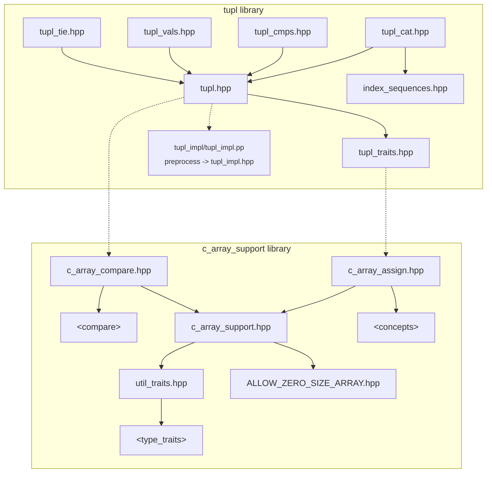
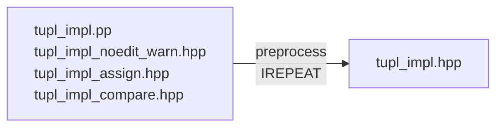

# `tupl`: aggregate tuple types

## Minimal C++20 tuples, traits and tools

<details><summary>Copyright &copy; 2023 The Lemuriad.
Distributed under BSL V1.0</summary>

### **Boost Software License** - Version 1.0 - August 17th, 2003

```txt
Permission is hereby granted, free of charge, to any person or organization
obtaining a copy of the software and accompanying documentation covered by
this license (the "Software") to use, reproduce, display, distribute,
execute, and transmit the Software, and to prepare derivative works of the
Software, and to permit third-parties to whom the Software is furnished to
do so, all subject to the following:

The copyright notices in the Software and this entire statement, including
the above license grant, this restriction and the following disclaimer,
must be included in all copies of the Software, in whole or in part, and
all derivative works of the Software, unless such copies or derivative
works are solely in the form of machine-executable object code generated by
a source language processor.

THE SOFTWARE IS PROVIDED "AS IS", WITHOUT WARRANTY OF ANY KIND, EXPRESS OR
IMPLIED, INCLUDING BUT NOT LIMITED TO THE WARRANTIES OF MERCHANTABILITY,
FITNESS FOR A PARTICULAR PURPOSE, TITLE AND NON-INFRINGEMENT. IN NO EVENT
SHALL THE COPYRIGHT HOLDERS OR ANYONE DISTRIBUTING THE SOFTWARE BE LIABLE
FOR ANY DAMAGES OR OTHER LIABILITY, WHETHER IN CONTRACT, TORT OR OTHERWISE,
ARISING FROM, OUT OF OR IN CONNECTION WITH THE SOFTWARE OR THE USE OR OTHER
DEALINGS IN THE SOFTWARE.
```

[](https://www.boost.org/LICENSE_1_0.txt)

Also at [boost.org](http://www.boost.org/LICENSE_1_0.txt) and accompanying file [LICENSE](LICENSE)

</details>

<table style="width: 100%; border: none;" cellspacing="0" cellpadding="0" border="0">
  <tr>
    <td><a href="https://github.com/Lemurian-Labs/tupl/actions/workflows/ci.yml"></a></td>
    <td>GHA meson build: linux gcc 12, clang 14, MSVC latest</td>
  </tr>
</table>

<table style="width: 100%; border: none;" cellspacing="0" cellpadding="0" border="0">
  <tr>
    <td><a href=https://godbolt.org/z/85Tex45c1></a></td>
    <td>Please experiment with <code>tupl</code> and report any issues<br>
        $\Leftarrow$ follow this link to 'godbolt' online C++ compilers</td>
  </tr>
</table>

----

## Contents

* [`tupl`](#tupl-introduction) introduction
and [API](#tupl-api-by-example) examples
* [`ties`](#ties-introduction) introduction
and [API](#ties-api-by-example) examples
* [Comparisons](#comparisons), `cmps`, 3-way and equals
* [Aggregate properties](#aggregate-properties), [Layout](#layout) and [Member ids](#member-ids)
* [Headers](#headers), [Dependencies](#dependencies) and [Build](#build)
* [Appendices](readmore.md#appendices):
[Initialization](readmore.md#initialization) and
 [Assignments](readmore.md#assignments)  
 [`tupl` design](#tupl-design-notes) and `std::tuple` comparison

## `tupl` introduction

**`tupl`** is a tuple type for C++20 with low
[abstraction penalty](
https://en.wikipedia.org/wiki/High-level_programming_language#Abstraction_penalty).

Imagine if C++ had tuples built in to the language...

* **`tupl<E...>`** $\rightarrow$ `struct { E ...x; };`

That is, `tupl` is simply a struct aggregate with  member types `E...`

As an aggregate,
the properties of its elements propagate up to `tupl`:

* If `E...` are all
[trivial](https://en.cppreference.com/w/cpp/named_req/TrivialType) /
[structural](https://eel.is/c++draft/temp.param#def:type,structural) /
[regular](https://en.cppreference.com/w/cpp/concepts/regular) types  
then `tupl<E...>` is a trivial / structural / regular type.

In particular, a `tupl` is
[*TriviallyCopyable*](https://en.cppreference.com/w/cpp/named_req/TriviallyCopyable)
if all its elements are.  
Trivial types are cheap to pass to and return from functions and enable  
compilers to inline deeper, realising more optimization opportunities.

`tupl` has *no non-static member functions*.
A true 'Rule of Zero' type,  
it relys on builtin langauge mechanics for much of its 'API'.

### Aggregate nature

`tupl` embraces curly braces! Its builtin 'API' encourages their use.

Braces protect against narrowing conversions in aggregate initialization  
and so also in 'aggregate assignment' from a braced initializer-list.  
Class template argument deduction works nicely with braces
{[CTAD](https://en.cppreference.com/w/cpp/language/class_template_argument_deduction)}:

```c++
  tupl cppstd = {"c++",17}; // CTAD + aggregate init
  if (cppstd < tupl{"c++",20}) // same-types compare
     cppstd = {"c++",23}; // 'aggregate assignment'
  cppstd = {"c++"}; // ok?
             // ^  warning: missing int init value
```

In C++20, aggregates can also be initialized with parentheses, `tupl(d,k)`.  
This 'constructor syntax' is useful constructing objects of any, generic, type,  
but the parens admit narrowing conversions and argument decay.

$\Rightarrow$ *Prefer curlies* !

`tupl` embraces C arrays and regularizes them;
tupl-of array is a regular type  
(`std::tuple`, in contrast, is hostile to C array).

$\Rightarrow$ *Aggregates should stick together* !

## `tupl` API by example

`tupl` is simple yet sufficient for most tuple use cases.

Understanding `tupl`'s API starts with understanding C++ language rules  
around aggregate types, their benefits and limitations.

`tupl` elements are all public and can be accessed directly by member id,  
by structured binding, or by conventional indexed access `get<I>(t)`.  

Assignment is builtin. Comparisons are `=default`, if possible.

```c++
#include <tupl/tupl.hpp>

// CTAD deduces <int,unsigned,char[2]> from {0,1U,"2"}
constexpr lml::tupl t012 = {0,1U,"2"};

auto tupl_API(lml::tupl<int,unsigned,char[2]> t = t012)
{
  auto s{t}; // Copy construct, as struct aggregate

  assert(s == t); // Same types are comparable
  // (Only same types are comparable, unlike tuple)

  s = t; // Copy-assign, aggregate struct builtin
  // (Only same types are assignable, unlike tuple)

  swap(s,t); // Specialized elementwise lml::swap

  t = {}; // Clear by builtin 'aggregate assignment'
  assert(equals(t,{})); // t == {} syntax is illegal

  s = {1,2,"3"}; // Builtin 'aggregate assignment'

  auto& [i,u,c2] = s; // Structured binding access
                      // by builtin aggregate rule
                     // (not by std 'tuple protcol')

  t = {i,u}; // WARN of missing initializer, and...
  t = {u,i}; // WARN or FAIL, narrowing conversions

//t = {i,u,c2}; // FAIL: array variable initializer

// assign(t) function handles array variables
  assign(t) = {i,u,c2}; // all initializers needed
/*
  Note: assign from braced list can only copy-assign
  or move-assign from _all_ initializers, not a mix.

  assign_elements allows elementwise move or copy:
*/
  assign_elements(t,i,u,c2);

  t.x0 = {1}; // Direct access by known member id
  get<1>(t) = {2}; // Usual indexed get<I> access
//get<2>(t) = {"3"}; // FAIL: can't assign arrays

  lml::assign(get<2>(t)) = {"3"}; // array assign
/*
  getie<2>(t) = {"3"}; // From <tupl/tupl_tie.hpp>
*/
  using lml::flat_index; //(1st array elem& or arg&)

  // This map adds 3 to each element of tupl t:
  map(t ,[](auto&...a){((flat_index(a)+=3),...);});

  assert((t == lml::tupl{4,5U,"6"}));

  return lml::tupl{t, true}; // Nested tupl return
      // tupl< tupl<int, unsigned, char[2]>, bool >
}
```

> **Note**: Compilers disagree on the layoutand `sizeof` the return type.  
> For portable standard layout use 'layout tuple' `lupl` instead of `tupl`  
> see the section on [layout](#layout) below.

### `tupl` `map`

`map` is a helper function for iterating `tupl` elements as a variadic pack.  
It's intended as a generic access facility for implementing other accessors  
such as `for_each` functions.

`map` is a
[hidden friend function](https://www.justsoftwaresolutions.co.uk/cplusplus/hidden-friends.html)
defined within `tupl` classes.

As such, `map` is  hidden from ordinary name lookup and can only be found  
by [ADL](https://en.cppreference.com/w/cpp/language/adl),
argument dependent lookup, when passed a `tupl` argument.

`map(t,f)` calls functor `f` with tupl `t`'s elements `x...` as arguments:

`map(t,f) -> f(x...)`

The functor `f` will usually accept `x...` as a variadic argument pack.

As an example of `map` usage, here's a `tupl` stream printer:

```c++
#include <iostream>
using std::ostream;

#include "tupl.hpp"
using lml::tuplish; // concept to accept tupl-likes
using lml::as_tupl_t; // cast to embedded tupl type
extern auto tupl_API(); // from the snippet above

/* tupl stream print operator<<, a 'map' usage demo */

ostream& operator<<(ostream& out, tuplish auto const& t)
{
  return map(as_tupl_t(t), [&out](auto&...a) -> auto&
  {
    char sep = '{';
    auto sep_out = [&]{ // output '{' on first call
           out << sep; // output ',' on following calls
           [[maybe_unused]]static auto _(sep = ',');
         };

    return (out << ... << (sep_out(), a)) << '}';
  });
}

int main()
{
    std::cout << std::boolalpha << tupl_API();
}
// Outputs nested tupl return value: {{4,5,6},true}.
```

### `tuplish` types

The `tuplish` concept requires a member typedef `tupl_t` on which a  
`map` function is defined. Prior to calling `map`, the `as_tupl_t(t)` cast  
assures that the embedded type is used for lookup.

`tupl` is intended by design to be used as a base class for other tuplish  
types that extend its API by adding constructors or member functions  
(but not member data; the `tupl` base should hold all data members).

Deriving from `tupl` automatically makes the derived type `tuplish`,  
gaining tuple access for free.

`tupl` is primarily a value type, i.e. it is meant to hold values.  
The `tupl` CTAD guide deduces element types by-value.

As a generic base, though, `tupl` element types are unconstrained so it  
may hold lvalue references, rvalue references or even function references.

Besides `tupl` and `lupl`, the library provides three derived `tuplish` types;

* `ties`, `cmps` and `vals`

`ties` is specialized for tuples of references.

## `ties` introduction

`ties` type derives from `tupl` and adds a set of `operator=` overloads.  

* **`ties<E...>` : `tupl<E...>`** $+$ `operator=`

`ties` remains trivially copyable while providing extra tuple assignments.  

The intended use case is reference-tuples, which are used for assignment  
of multiple variables or for lexicographic comparison of tuples of variables.

Structured bindings, introduced in C++17, replace some use cases of `ties`,  
but not all.
Default synthesized comparison operators, introduced in C++20,  
help with lexicographic comparison but `ties` cover cases not covered by the  
standard - comparison of reference members in particular.

`tie` or `tie_fwd` 'maker functions' are the preferred way to make `ties`,  
returning const-qualified `ties` tupls:

* `tie(x...)` $\rightarrow$ `ties<decltype(x)&...> const`
* `tie_fwd(x...)` $\rightarrow$ `ties<decltype(x)...> const`

`tie` accepts only lvalues and deduces lvalues as targets for assignments.  
`tie_fwd` forwards its `auto&&` arguments, like `std::forward_as_tuple`.

**Why `const`?**:  
The const qualifier removes the deleted default assignment operators from  
consideration. The resulting const-qualified type satisfies *const-assignable*  
concept, identifying it as an 'assign-through' reference type.

## `ties` API by example

```c++
#include "tupl_tie.hpp"  // ties operator= overloads

bool tie_API(int i, unsigned u, char(&c2)[2])
{
  if (equals(lml::tie(i,u,c2), {})) // all elem==T{}
    lml::tie(i,u,c2) = {1,2,"3"}; // assign-through

  lml::tie(i,u,c2) = {}; // clear all to = {} init
  lml::tie(c2) = {{'4'}}; // assign from array rvalue
  char five[] = "5";
  lml::tie(c2) = {five}; // assign from array lvalue

  lml::tupl t = {1,2,"3"};

  getie<2>(t) = {"5"}; // assign to array element
  getie<0,1>(t) = {3,4}; // multi-index get -> tie

  return z;
}
```

Assignment from braced list `={...}` is a simple
syntax that extends nicely  
to reference ties just as for value tuples.  

`ties` list-assignment keeps the semantics of the equivalent `tupl` builtin  
aggregate assignment in only allowing non-narrowing conversions, then  
differs in that it handles arrays and avoids creating temporaries but it can  
only handle all-move (rvalue) or all-copy (lvalue) assignments, not a mix.

`ties` also admits assignments from other tuplish types.  
To mix move and copy assignments, assign from a forwarding tupl:

```c++
  lml::tie(cp,mv) = tie_fwd(cc, std::move(mm));
```

### Other `tuplish`

* `tupl{v...}` the basic tuple; deduces all values, nothing added.
* `lupl{v...}` a basic `tupl` without `[[no_unique_address]]`.

`tupl` derived types `ties`, `cmps` & `vals` add specific operators:

* `ties{v...}` deduces forwarding references, adds assignments.
* `vals{v...}` deduces all values, adds assignments.
* `cmps{v...}` deduces 'tupl_view' types, adds comparisons.

`ties` and `vals` opt in to heterogeneous assignments from other tupl types  
with compatible assignable types, as well as assignments from braced-lists.

`cmps` opts in to heterogeneous comparisons with other tupl types where  
all corresponding elements are comparable.

The intent of each type is reflected in its CTAD rules.  
Four types add only CTAD, to deduce or constrain accepted types:

* `fwds{v...}` deduces forwarding references
* `lvals{v...}` accepts lvalues only, rejects rvalues
* `rvals{v...}` accepts rvalues only, rejects lvalues
* `cvals{v...}` deduces 'tupl_view' types; `const&` or values

(They add nothing else.)

## Comparisons

`tupl` three-way comparison `<=>` is defaulted as a hidden friend function,  
if that's possible, otherwise it's implemented out-of-class, if possible.

The comparison operators are only defined for exact same-type tupls.

### `tupl` operands are same-type only

* `std::tuple` can assign-from any tuple of assignable-from types and it  
can compare-with any tuple of comparable-with types.
  
* `tupl`'s builtin assignment and default comparisons naturally only work  
for operands of the same type.

This same-type restriction is a safe default.

Heterogeneous or converting operations are provided by free functions  
or by use of derived `tuplish` types that add the desired operators.  

For heterogeneous assignments, functions `assign` and `assign_elements`  
were introduced above, along with `ties` and `vals` tuplish assignment types.

For heterogeneous comparisons there are free functions:

```c++
  compare3way(l,r)
  equals(l,r)
```

Note that the `compare3way` function accepts tupls of different size  
(unlike the `std` equivalent).

The `cmps` tupl type adds heterogenous comparisons, e.g.:

```c++
  #include <string>
  using std::string::operator""s;

  tupl stringstd{"c++"s,20};

  if (stringstd == cmps{+"c++",20}) ;
```

Here the `std::string` element is compared with a `char*` value  
(the `+` is needed to force decay because `tupl` always avoids decay).

## Aggregate properties

`tupl` is always aggregate, regardless of element types:

```c++
  using Up = tupl<unique_ptr>;
  static_assert( is_aggregate<Up>() ); // always
```

As a struct aggregate of its element types it propagates their properties:

```c++
  tupl tup = { 1, 2U, "3" };
// tupl<int, unsigned, char[2]>

  using Tup = decltype(tup);

  static_assert( is_trivially_copyable<Tup>()
              &&    is_standard_layout<Tup>()
              &&            is_trivial<Tup>()
              &&            is_regular<Tup>()
               );
```

`tupl` is structural if all its element types are.  
A type is *structural* if it can be used as a non-type template parameter:

```c++
  template <auto> using is_structural = true_type;
  static_assert(        is_structural<Tup{}>());
```

## Layout

**`tupl`** layout has `[[no_unique_address]]` attribute on all members.  
**`lupl`** is a 'layout compatible' tupl without `[[no_unique_address]]`.

Don't use `tupl` in multi-platform external APIs - **it isn't portable**.  
Instead, use `lupl` where portable standard layout is required.  

`lupl` is layout compatible with an equivalent struct aggregate.  
It's safe to reinterpret_cast a struct to a lupl for tuple-like access;  
`std::is_layout_compatible` provides the required check:

```c++
  struct Agg {int i; unsigned u; char c[2];} agg;

  using Lup = lupl<int, unsigned, char[2]>;
  static_assert(is_layout_compatible<Lup,Agg>());

  // access agg as a tuple
  get<1>(reinterpret_cast<Lup&>(agg)) = 2u;
```

`tupl` is also layout compatible with an equivalent struct aggregate,  
i.e. one with `[[no_unique_address]]` attribute on all members:

```c++
  struct Agu { [[no_unique_address]] int i;
               [[no_unique_address]] unsigned u;
               [[no_unique_address]] char c[2];
             };
  static_assert(is_layout_compatible<Tup,Agu>());
  static_assert(!is_layout_compatible<Tup,Agg>());
```

**Again**: `tupl` layout is not guaranteed portable; clang and gcc differ in  
layout and `sizeof` for some simple cases.
Don't use in external APIs  
that may be compiled with different compilers, or compiler versions.  
Use `lupl` instead.

## Member ids

As provided, `tupl` supports up to 16 elements.  
Their member ids are the hex-digits of the index with `x` prefix:

```c++
  x0, x1, x2, x3, x4, x5, x6, x7,
  x8, x9, xa, xb, xc, xd, xe, xf
```

or, reconfigured to 32, e.g. by build option `tupl_max_arity=32`

```c++
  x0,  x1,  x2,  x3,  x4,  x5,  x6,  x7,
  x8,  x9,  xa,  xb,  xc,  xd,  xe,  xf,
 x10, x11, x12, x13, x14, x15, x16, x17,
 x18, x19, x1a, x1b, x1c, x1d, x1e, x1f
```

which sets preprocessor flag `TUPL_MAX_ARITY=(2)(0)` for `0x20`  
elements maximum (and reflected in the `tupl_max_arity` constant).

Elements may be accessed by member id, `get`, or the new `getie`:

```c++
  &tup.x2 == &get<2>(tup);
  getie<2>(tup) = {"3"};
```

Here, `getie<2>(tup)` combines `get` and `tie` as `tie(get<2>(tup))`.

## Headers

* **`tupl.hpp`** provides basic value tuple types, `tupl` and `lupl`,  
tupl-derived types with CTAD, `fwds`, `lvals`, `rvals` & `cvals`,  
accessors, `get<I>`, `get<T>`, `tupl_mptr` &  `tupl_mptrs`,  
comparison operators `<=>`,`==`, plus `equals` & `compare3way`  
free functions, `assign` & `assign_elements` (no `operator=`).

* **`tupl_traits.hpp`** defines concepts, traits and type-list tools  
useful for type-list manipulation and for defining tuplish types.

* **`tupl_cat.hpp`** defines `tupl_init` and `tupl_cat` functions.

* **`index_sequences.hpp`** exposes `integer_sequence` tools,  
used by `tupl_cat`.

`tupl`-derived types:

* **`tupl_tie.hpp`** derives a `ties` tupl for reference tuples  
with added assignment operators, plus `tie` and `getie` functions.
* **`tupl_vals.hpp`** derives a `vals` tupl, with added assignment ops.
* **`tupl_cmps.hpp`** derives a `cmps`, tupl with added comparison ops.

(`tupl_platform.hpp` is an internal header of macros for portability.)

**`tupl_amalgam.hpp`** amalgamates all these library headers in one, along  
with all required headers from the `c_array_support` library dependency.  
The amalgam is auto-generated (so don't edit it!).

## Dependencies

Sibling library dependencies:

* **`c_array_support`** for C array assignment and comparison.
* **`IREPEAT`** (optional dependency, mostly for developers).

**`std`** C++ dependencies:

* `<`**`concepts`**`>` for `assignable_from`, `ranges::swap`, etc.
* `<`**`compare`**`>` for three-way `operator<=>` comparisons, etc.
* `<cstdint>` is also required on MSVC, for `uintptr_t` only.

Note: no dependence on `<utility>` or use of `index_sequence`;  
`tupl` does not subscribe to the `std` 'tuple protocol'.

The `#include` dependencies are best seen in a diagram.



[**`c_array_support`**](https://github.com/lemuriad/c_array_support)
is a sibling library split out early in development of  
`tupl` and published alongside in the Lemuriad GitHub organization.  

[`IREPEAT`](https://github.com/lemuriad/IREPEAT)
is also published in the Lemuriad GitHub organization.  
See below for details of its use in preprocessor codegen.

`tupl` depends on non-standard compiler extensions.  
integer-sequence builtins are used that are compiler-specific.  
This is done to avoid dependency on `std` `<integer_sequence>`.

### Developer dependencies

* [`snitch`](https://github.com/cschreib/snitch) lightweight C++20 testing framework
* [`meson`](https://mesonbuild.com/) version >= 0.64.0 (no CMake yet)
* Python is required for meson build
* `bash` shell, or `git-bash` or similar on Windows,  
to run the `amalgamate.sh` shell script

## Build

A build setup is recommended, even for header-only projects, although  
single header `tupl_amalgam.hpp` provides a quick way to get started.  

[meson.build](https://mesonbuild.com/) scripts are provided
requiring `meson` >= v0.64.0  
(there's no CMake support yet; contributions are welcome.

`meson setup` fetches all dependencies from GitHub repos automatically,  
if they are not present, or they can be download manually if preferred.

```bash
  git clone https://github.com/Lemuriad/tupl.git
  cd tupl
  meson setup build
  meson compile -C build
  meson test sanity -C build
  meson test -C build
```

* Fetch dependencies from github (via meson git-wraps)
* Marshall header paths
* Specify build flags and configuration options
* Preprocess $\rightarrow$ `tupl_impl.hpp`
* Generate $\rightarrow$ `tupl_amalgam.hpp`
* Build and run tests
* ToDo: Benchmarks and static analysis

See demo project
[`tupl_xampl`](https://github.com/Lemuriad/tupl_xampl)
for an example client setup, using meson.

When the `tupl` library is used as a meson subproject dependency then test  
targets are not set up by default, and the `snitch` library is not downloaded.  
Use build configuration option `-D tupl:tests=enabled` if you want tests.

A custom target is added to auto-generate the `tupl_amalgam.hpp` header,  
when build option `tupl_codegen=enabled` is configured (not by default).

### Codegen

The [`IREPEAT`](https://github.com/lemuriad/IREPEAT)
preprocessor library is used to generate `"tupl_impl.hpp"`  
by preprocessing `tupl_impl/tupl_impl.pp"` and component includes:



It's possible to generate `tupl_impl.hpp` by direct preprocessor invocation,  
e.g. from the root directory with these GCC options:

```bash
g++ -I. -Isubprojects/IREPEAT -Itupl_impl
    -MMD -nostdinc -C -E -P
    -o tupl_impl.hpp tupl_impl/tupl_impl.pp
```

The meson build scripts set up a target to auto-generate `tupl_impl.hpp`  
initially, and on recompiles if the `tupl_impl` implementation files are edited.

meson v0.64.0 introduced support for preprocessor targets so this sets the  
minimum version requirement.
Support is improved in more recent versions.

The build target doesn't appear to be invocable from the meson commandline.  
It can be invoked from the ninja backend:

```bash
ninja -C build tupl_impl.hpp
```

`tupl_amalgam.hpp` is also a build target.  
To generate the amalgamated header, run:

```bash
meson compile -C build tupl_amalgam.hpp
```

### Build configuration options

`-D tupl_max_arity` configures the max number of elements.  
`-D no_lupl` option omits the codegen of `lupl` specializations.  
`-D namespace_id` configures the library namespace.  
`-D tests` set `=enabled` or `=disabled` to control test targets.  
`-D tupl_codegen` set `=enabled` for `tupl_amalgam.hpp` generation  
or set `=disabled` to inhibit `IREPEAT` download.

The default configuration sets `tupl_max_arity` as 16 (== 0x10).  
To configure a different max (use meson `--wipe` flag to reconfigure):

```bash
  meson setup -D tupl_max_arity=24 build
```

When a proper variadic implementation of `tupl` becomes possible,  
then `max_arity` will be made meaningless...

### Preprocessor config

Preprocessor symbols implement the configuration options:

`TUPL_MAX_ARITY` sets the number of arity specializations.  
`NO_LUPL` conditionally compiles-out `lupl` definition.  
`NAMESPACE_ID` changes the default `lml` namespace.  
`TUPL_IMPL_PREPROCESS` forces preprocessing on recompile.

## [Appendices](readmore.md#appendices)
* [Initialization](readmore.md#initialization), [Assignments](readmore.md#assignments), [Design](#tupl-design-notes)
