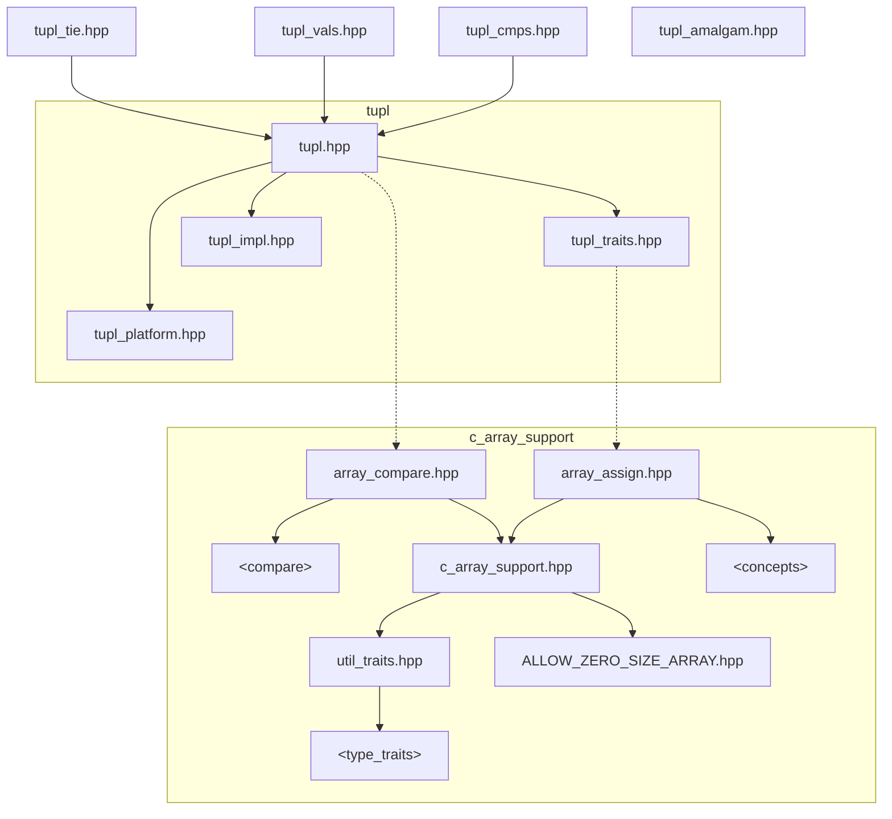
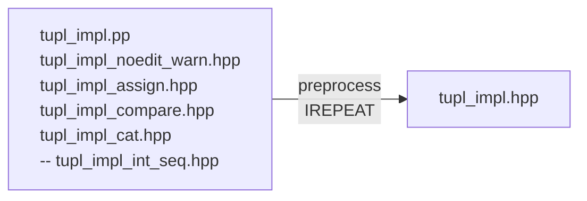

# `tupl`: trivial tuple types

## Minimal C++20 tuples, traits and tools

<details><summary>Copyright &copy; 2023 Lemurian-Labs.
Distributed under BSL V1.0</summary>

### **Boost Software License** - Version 1.0 - August 17th, 2003

```txt
Permission is hereby granted, free of charge, to any person or organization
obtaining a copy of the software and accompanying documentation covered by
this license (the "Software") to use, reproduce, display, distribute,
execute, and transmit the Software, and to prepare derivative works of the
Software, and to permit third-parties to whom the Software is furnished to
do so, all subject to the following:

The copyright notices in the Software and this entire statement, including
the above license grant, this restriction and the following disclaimer,
must be included in all copies of the Software, in whole or in part, and
all derivative works of the Software, unless such copies or derivative
works are solely in the form of machine-executable object code generated by
a source language processor.

THE SOFTWARE IS PROVIDED "AS IS", WITHOUT WARRANTY OF ANY KIND, EXPRESS OR
IMPLIED, INCLUDING BUT NOT LIMITED TO THE WARRANTIES OF MERCHANTABILITY,
FITNESS FOR A PARTICULAR PURPOSE, TITLE AND NON-INFRINGEMENT. IN NO EVENT
SHALL THE COPYRIGHT HOLDERS OR ANYONE DISTRIBUTING THE SOFTWARE BE LIABLE
FOR ANY DAMAGES OR OTHER LIABILITY, WHETHER IN CONTRACT, TORT OR OTHERWISE,
ARISING FROM, OUT OF OR IN CONNECTION WITH THE SOFTWARE OR THE USE OR OTHER
DEALINGS IN THE SOFTWARE.
```

[](https://www.boost.org/LICENSE_1_0.txt)

Also at [boost.org](http://www.boost.org/LICENSE_1_0.txt) and accompanying file [LICENSE](LICENSE)

</details>

----

* [`tupl`](#tupl-introduction) introduction
and [API](#tupl-api-by-example) examples
* [`ties`](#ties-introduction) introduction
and [API](#ties-api-by-example) examples
* [Comparisons](#comparisons), `cmps`, 3-way and equals
* [Headers](#headers) and $\rightarrow$ **CE playground** $\leftarrow$
* [Triviality, Layout](#triviality-and-layout) and [Member ids](#member-ids)
* [Dependencies](#dependencies) and [Build](#build)
* [Appendix](readmore.md#appendices)  
[Initialization](readmore.md#initialization) and
 [Assignments](readmore.md#assignments)  
 [`tupl` design](#tupl-design-notes) (some `std::tuple` comparison)

## `tupl` introduction

**`tupl`** is a tuple type for C++20 with low
[abstraction penalty](
https://en.wikipedia.org/wiki/High-level_programming_language#Abstraction_penalty).

Imagine if C++ had tuples built in to the language...

* **`tupl<E...>`** $\rightarrow$ `struct { E ...x; };`  
  * A struct aggregate with  member types `E...`

`tupl` has no non-static member functions -
a true 'Rule of Zero' type.  
As an aggregate,
the properties of its elements propagate up to `tupl`:

* If `E...` are all trivial / structural / regular types  
then `tupl<E...>` is a trivial / structural / regular type.

In particular, a `tupl` is
[TriviallyCopyable](https://en.cppreference.com/w/cpp/named_req/TriviallyCopyable)
if all its elements are.  
Trivial types are cheap to pass to and return from functions and enable  
compilers to inline deeper, realising more optimization opportunities.

### Aggregate nature

`tupl` embraces curly braces! Its builtin API encourages their use.  
Class template argument deduction works nicely with braces
{[CTAD](https://en.cppreference.com/w/cpp/language/class_template_argument_deduction)}.  
Braces protect against narrowing conversions in aggregate initialization  
and so also in 'aggregate assignment' from a braced initializer-list:

```c++
  tupl cppstd = {"c++",17}; // CTAD + aggregate init
  if (cppstd < tupl{"c++",20}) // same-types compare
     cppstd = {"c++",20}; // 'aggregate assignment'
  cppstd = {"c++"}; // ok?
             // ^  warning: missing int init value
```

In C++20, aggregates can be initialized with parentheses, `tupl(d,k)`,  
'constructor syntax' so they can be made like other types in generic code.  
Prefer curlies otherwise; parens admit narrowing conversions and decay.

`tupl` embraces C arrays and regularizes them;
arrays aren't
[regular](https://en.cppreference.com/w/cpp/concepts/regular) but  
tupl-of array is a regular type.
Aggregates should stick together!

## `tupl` API by example

`tupl` is simple yet sufficient for most tuple use cases.

`tupl` elements are public; they can be accessed directly by member id,  
by conventional indexed access `get<I>(t)`, or by structured binding.  
Assignment is builtin. Comparisons are `=default`, or defined the same.

```c++
#include "tupl.hpp" // aggregate tuple

auto tupl_API(lml::tupl<int,unsigned,char[2]> tup={})
{
  bool z = equals(tup,{}); // each element e == E{}
               // tup == decltype(tup){}

  auto& [i,u,c2] = tup; // structured binding access

//tupl c{i,u,c2}; // FAIL: array-valued initializer
                  // use tupl_init array workaround:

  auto c = lml::tupl_init(i,u,c2); // maker function

  auto dup = tup;  // copy
  dup = {};        // clear by 'aggregate assign'={}
  if (tup != dup)  // only same types are comparable
    swap(dup,tup); // swap elementwise (specialized)

  tup.x0 = {i}; // direct access by known member id
  get<1>(tup) = {u}; // usual indexed get<I> access
//get<2>(tup) = {c2}; // FAIL: can't assign arrays
  lml::assign(get<2>(tup)) = {c2}; // array assign
//getie<2>(tup) = {c2}; // assign array (see later)

  dup = {1,2,"3"}; // 'aggregate assignment'
//tup = {1,2,c2}; // FAIL: array-valued initializer
  assign(tup) = {i,u,c2}; // handles array values
  assign_elements(tup,u,i,c2); // allows conversions
                  //  ^ ^ -> no warning on narrowing

  using lml::flat_index; //(1st array elem, or arg&)

  // This map adds 3 to each element of dup:
  map(dup,[](auto&...a){((flat_index(a)+=3),...);});

  z = z && (dup <=> lml::tupl{4,5U,"6"} == 0);

  auto dub = cat(tup,dup); // concatenate tupls

  z = z && equals(dub, {2,1,"3",4,5,"6"}); // == list
  z = z && compare3way(tup,dub) < 0; // lexicographic
  // Note: different length tupl compare3way works

  return lml::tupl{dup, z}; // nested tupl return
}
```

> **Note**: GCC and Clang disagree on [layout](#triviality-and-layout)
and `sizeof` the return type.  
For portable standard layout, use sibling type `lupl` instead of `tupl`.

The hidden friend function `map` helps iterate `tupl` elements as a pack;  
`map(t,f)` calls functor `f` with tupl `t`'s elements as arguments.

Here's another example of `map` usage; a `tupl` stream printer:

```c++
#include <iostream>
using std::ostream;

#include "tupl.hpp"
using lml::tuplish; // concept to accept tupl-likes
using lml::as_tupl_t; // cast to embedded tupl type
extern auto tupl_API(); // from the snippet above

/* tupl stream print operator<<, a 'map' usage demo */

ostream& operator<<(ostream& o, tuplish auto const& t)
{
  char s = '{'; // separator char open '{' then ','
                // via 'call-once' static init
  auto c = [&]{[[maybe_unused]]static char x= s=',';};

  return map(as_tupl_t(t), [&](auto&...a) -> auto& {
    return (o << ... << (o<<s, c(), a)) << '}';
  });
}

int main()
{
    std::cout << std::boolalpha << tupl_API();
}
// Outputs nested tupl return value: {{4,5,6},true}.
```

The `tuplish` concept requires a member typedef `tupl_t` with a `map`,  
then `as_tupl_t(t)` casts to the embedded type prior to calling `map`.  

### `tupl` operands are same-type only

`std::tuple` can assign-from any tuple of assignable-from types and it  
can compare-with any tuple of comparable-with types.

`tupl` itself does not provide 'heterogeneous' or 'polymorphic' operators.  
`tupl`'s builtin assignment and default comparisons naturally only work  
for operands of the same type.

This is a safe default.
For heterogeneous or converting operations use free  
functions `assign`, `assign_elements`, `equals` and `compare3way`.  
Or use a derived `tuplish` type that adds only the desired operators.

### `tuplish` types

`tupl` is intended by design to be used as a base class to hold all the data  
members of classes that want tuple access and free conversion to `tupl`.  
Deriving from `tupl` automatically makes the derived type `tuplish`.

`tupl` itself is meant for tuples of values;
it's CTAD guide deduces values.  
Element types are unconstrained though; they may be lvalue reference,  
rvalue reference, const or even function reference type.

In particular, it's useful to deal with reference members in their own type;  
meet `ties`...

## `ties` introduction

`ties` type derives from `tupl` and adds a set of `operator=` overloads.  

* **`ties<E...> : tupl<E...>`** $ \space + \space \textsf{operator=}$

`ties` remains trivially copyable while providing extra tuple assignments.  

The intended use case is reference-tuples, for assignment or comparison  
of multiple variables.
Structured bindings replace some use cases; not all.

`tie` and `tie_fwd` functions return const-qualified `ties` tupls  
(the const qualifier disables the deleted default assignments):

* `tie(x...)` $\rightarrow$ `ties<decltype(x)&...> const`
* `tie_fwd(x...)` $\rightarrow$ `ties<decltype(x)...> const`

`tie` or `tie_fwd` 'maker functions' are the preferred way to make `ties`  
(`ties` CTAD deduces forwarding references, but can't const-qualify).

`tie` accepts only lvalues and deduces lvalues as targets for assignments.  
`tie_fwd` forwards all its arguments, like `std::forward_as_tuple`.

## `ties` API by example

```c++
#include "tupl_tie.hpp"  // ties operator= overloads
#include "tupl_cmps.hpp" // cmps operator== and <=>

bool tie_API(int i, unsigned u, char(&c2)[2])
{
  if (equals(lml::tie(i,u,c2), {})) // all elem==T{}
    lml::tie(i,u,c2) = {1,2,"3"}; // assign-through

  // or use operator== and a cmps tupl to compare
  z = lml::tie(i,u,c2) == lml::cmps{0,0U,"\0"};
  z = lml::tie(i,u,c2) == lml::cmps{{}}; // all=={}

  lml::tie(i,u,c2) = {}; // clear all to = {} init
  lml::tie(c2) = {{'4'}}; // assign from array rvalue

  lml::ties refs = {i,u,c2}; // ties CTAD->references
//refs = {i,u,c2}; // ambiguous overload (non const)
  using as_const = decltype(refs) const&;
  (as_const)refs = {i,u,c2}; // const disambiguates

  getie<2>(refs) = {"5"}; // assign to array element
  getie<0,1>(refs) = {3,4}; // multi-index get -> tie

  return z;
}
```

`tie` assignment accepts braced init-lists (as do the free functions).

Assignment from braced list `={...}` is a
"keep simple things simple"  
syntax that extends nicely to reference ties just as for value tuples.  

`ties` list-assignment keeps the semantics of the equivalent `tupl` builtin  
aggregate assignment in only allowing non-narrowing conversions, then  
differs in that it handles arrays and avoids creating temporaries but it can  
only handle all-move (rvalue) or all-copy (lvalue) assignments, not a mix.

`ties` also admits assignments from other tuplish types
(see [assignment](#assignments)).  
To mix move and copy assignments, assign from a forwarding tupl;

```c++
  lml::tie(c,m) = lml::fwds{cc, std::move(mo)};
```

(There's no need to use the `tie_fwd` function, but it might be clearer.)

### Other `tuplish`

* `tupl{v...}` the basic tuple; deduces all values, nothing added
* `lupl{v...}` a basic `tupl` without `[[no_unique_address]]`

`tupl` derived types `ties`, `cmps` & `vals` add specific operators:

* `ties{v...}` deduces forwarding references, adds assignments
* `vals{v...}` deduces all values, adds assignments
* `cmps{v...}` deduces 'tupl_view' types, adds comparisons

`ties` and `vals` opt in to assignments from other tupl types with  
compatible assignable types as well as braced-list assignments.  
`cmps` opts in to comparisons with other comparable tupl types

The intent of each type is reflected in its CTAD rules.  
Four types add only CTAD, to deduce or constrain accepted types:

* `fwds{v...}` deduces forwarding references
* `lvals{v...}` accepts lvalues only, rejects rvalues
* `rvals{v...}` accepts rvalues only, rejects lvalues
* `cvals{v...}` deduces 'tupl_view' types; `const&` or values

(They add nothing else.)

## Triviality and layout

`tupl` is always aggregate, regardless of element types:

```c++
  using Up = tupl<unique_ptr>;
  static_assert( is_aggregate<Up>() ); // always
```

As a struct aggregate of its element types it propagates their properties:

```c++
  tupl tup = { 1, 2U, "3" };
// tupl<int, unsigned, char[2]>
  using Tup = decltype(tup);

  static_assert( is_trivially_copyable<Tup>()
              &&    is_standard_layout<Tup>()
              &&            is_trivial<Tup>()
              &&            is_regular<Tup>()
               );
```

`tupl` is structural if all its element types are
(a type is *structural* if it can  
be used as a non-type template parameter):

```c++
  template <auto> using is_structural = true_type;
  static_assert(        is_structural<Tup{}>());
```

**`tupl`** layout has `[[no_unique_address]]` attribute on all members.  
**`lupl`** is a 'layout compatible' tupl without `[[no_unique_address]]`

Don't use `tupl` in multi-platform external APIs - **it isn't portable**.  
Instead, use `lupl` where portable standard layout is required.  

`lupl` is layout compatible with an equivalent struct aggregate.  
It's safe to reinterpret_cast a struct to a lupl for tuple-like access;  
`std::is_layout_compatible` provides the required check:

```c++
  struct Agg {int i; unsigned u; char c[2];};

  using Lup = lupl<int, unsigned, char[2]>;
  static_assert(is_layout_compatible<Lup,Agg>());

  // access agg as a tuple
  Agg agg;
  get<1>(reinterpret_cast<Lup&>(agg)) = 2u;
```

`tupl` is also layout compatible with an equivalent struct aggregate,  
i.e. one with `[[no_unique_address]]` attribute on all members:

```c++
  struct Agu { [[no_unique_address]] int i;
               [[no_unique_address]] unsigned u;
               [[no_unique_address]] char c[2];
             };
  static_assert(is_layout_compatible<Tup,Agu>());
  static_assert(!is_layout_compatible<Tup,Agg>());
```

**Again**: `tupl` layout is not guaranteed portable; clang and gcc differ in  
layout and `sizeof` for some simple cases.
Don't use in external APIs  
that may be compiled with different compilers, or compiler versions.  
Use `lupl` instead.

## Member ids

As provided, `tupl` supports up to 16 elements.  
Their member ids are the hex-digits of the index with `x` prefix:

```c++
  x0, x1, x2, x3, x4, x5, x6, x7,
  x8, x9, xa, xb, xc, xd, xe, xf
```

or, reconfigured to 32, e.g. by build option `tupl_max_arity=32`

```c++
  x0,  x1,  x2,  x3,  x4,  x5,  x6,  x7,
  x8,  x9,  xa,  xb,  xc,  xd,  xe,  xf,
 x10, x11, x12, x13, x14, x15, x16, x17,
 x18, x19, x1a, x1b, x1c, x1d, x1e, x1f
```

which sets preprocessor flag `TUPL_MAX_ARITY=(2)(0)` for `0x20`  
elements maximum (and reflected in the `tupl_max_arity` constant).

Elements may be accessed by member id, `get`, or the new `getie`:

```c++
  &tup.x2 == &get<2>(tup);
  getie<2>(tup) = {"3"};
```

Here, `getie<2>(tup)` combines `get` and `tie` as `tie(get<2>(tup))`.

## Comparisons

`tupl` three-way comparison `<=>` is defaulted as a hidden friend function  
(if that's possible, else it's implemented out-of-class, if possible).

The comparison operators are only defined for exact same-type tupls.  
For heterogeneous comparisons there are named functions:

```c++
  compare3way(l,r)
  equals(l,r)
```

The `compare3way` function accepts tupls of different size.  
The `cmps` tupl type adds heterogenous comparisons, e.g.:

```c++
  #include <string>
  using std::string::operator""s;

  tupl stringstd{"c++"s,20};

  if (stringstd == cmps{+"c++",20}) ;
```

Here the `std::string` element is compared with a `char*` value  
(the `+` is needed to force decay because `tupl` always avoids decay).

## Headers

Top-level:

* **`tupl.hpp`** provides basic `tupl` and `lupl`, mainly for value tuples,  
plus `fwds`, `lvals`, `rvals` & `cvals` derived tupls, along with `get`,  
comparison operators, assignment & comparison functions,  
plus `tupl_cat` and `tupl_init` functions.
* **`tupl_tie.hpp`** provides a `ties` tupl, mainly for reference tuples  
with added assignments, plus `tie` and `getie` functions.
* **`tupl_vals.hpp`** provides a `vals` tupl, with added assignments.
* **`tupl_cmps.hpp`** provides a `cmps`, tupl with added comparisons.
* **`tupl_traits.hpp`** defines concepts, traits and type-list tools -  
useful for type-list manipulation and for defining tuplish types.

and:

* **`tupl_amalgam.hpp`** amalgamates all `tupl` library headers in one,  
along with all the headers from the `c_array_support` library.  
The amalgam is auto-generated by a CI script (don't edit it!).

Implementation details included by `tupl.hpp`:

* `tupl_impl.hpp` auto-generated `tupl` implementation; don't edit!  

* `tupl_platform.hpp`; platform-specific macros for portability of  
implementation, collected in a single file.

(The `tupl_impl_*.hpp` files under `tupl_dev/` aren't true headers,  
they're input files for generation of the `tupl_impl.hpp` header.)

## Dependencies

The `"tupl_amalgam.hpp"` single-header amalgamation reduces away  
all external dependencies. It allows easy exploration by url include on CE.

Dependencies are minimal though; a single external sibling library  
`"c_array_support"`, plus std `<concepts>` and `<compare>`.

If you want to reconfigure, develop or regenerate the implementation file  
`tupl_impl.hpp` then the optional dependency `"IREPEAT"` is needed.

[**`c_array_support`**](https://github.com/willwray/c_array_support)
provides generic assignment-to and comparison-of  
C array values alongside other regular types.  
C++ std dependencies:

* `<`**`concepts`**`>` for `assignable_from`, `ranges::swap`, etc.
* `<`**`compare`**`>` for three-way `operator<=>` comparisons, etc.
* `<cstdint>` is also required on MSVC, for `uintptr_t` only.

**Note**: no dependence on `<utility>` or use of `index_sequence`  
(integer-sequence builtins are used instead on supported platforms).

The build scripts fetch all dependencies from github repos automatically  
(or they can be download manually if preferred).

The `#include` dependencies are best seen in a diagram.



### Developer dependencies

The [`IREPEAT`](https://github.com/willwray/IREPEAT)
preprocessor library is used to generate `"tupl_impl.hpp"`.  
It preprocesses `tupl_dev/` file `"tupl_impl.pp"` and component includes:



`"tupl_impl.hpp"` is a generated file; don't edit it.

The `pcpp` preprocessor is used to generate the amalgamated header.  
See the CI script for its useage.

## Build

A build setup is recommended, even for header-only client projects.

No build is required; the provided `tupl_impl.hpp` is used by default  
(or just use a copy of `tupl_amalgam.hpp` to get going quickly).

A minimal meson.build setup is provided. CMake is coming.

* Fetch the dependencies from github
* Marshall the header locations
* Specify build flags and configuration options

```bash
  git clone https://github.com/Lemurian-Labs/tupl.git
  cd tupl
  meson setup build
  meson compile -C build
  meson test sanity -C build
  meson test -C build
```

### `tupl_impl.hpp` codegen

To run the code generation step for the tupl implementation:

```bash
  meson compile tupl_impl.hpp -C build
```

(`tupl_impl.hpp` is a custom target, not built by default).

Alternatively, invoke the preprocessor directly e.g. using these GCC  
options to generate `tupl_impl.hpp` in the current directory:

```bash
g++ -I. -Isubprojects/IREPEAT -Itupl_dev
    -MMD -nostdinc -C -E -P
    -o tupl_impl.hpp tupl_dev/tupl_impl.pp
```

### Configuration options

`-D tupl_max_arity` configures the max number of elements.  
`-D no_lupl` option omits the codegen of `lupl` specializations.  
`-D namespace_id` configures the library namespace.

The default configuration sets `tupl_max_arity` as 16 (== 0x10).  
To configure a different max (use meson `--wipe` flag to reconfigure)  
then rerun the codegen step as above:

```bash
  meson setup -D tupl_max_arity=24 build
  meson compile tupl_impl.hpp -C build
```

The codegen options will be made meaningless, and may be removed,  
in a future version that uses a proper variadic implementation.  
The `namespace_id` option is very niche so may also be removed when  
the `tupl` implementation no longer relies on preprocessor codegen.

### Preprocessor config

Preprocessor symbols implement the configuration options:

`TUPL_MAX_ARITY` sets the number of arity specializations.  
`NO_LUPL` conditionally compiles-out `lupl` definition.  
`NAMESPACE_ID` changes the default `lml` namespace.

For development

`TUPL_IMPL_PREPROCESS` forces preprocessing in recompiles  
(useful to avoid having to remember the manual codegen step).


* Execute the code generation step
* Create an amalgamated header
* Run tests and report results

## [Appendices](readmore.md#appendices)
* [Initialization](readmore.md#initialization), [Assignments](readmore.md#assignments), [Design](#tupl-design-notes)

Tested on recent GCC>=10, Clang and MSVC compilers.
